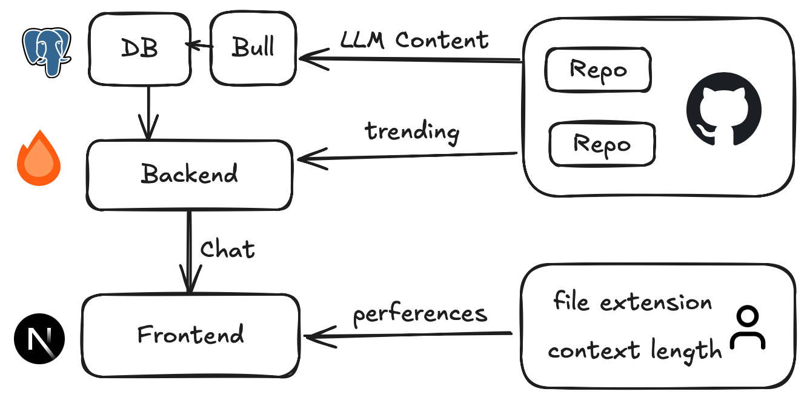

> [!CAUTION]
> This project is under development and not ready for production use.

# Chat With GitHub Trend

This project enables developers to chat with trending GitHub repositories using AI assistance. It automatically tracks GitHub's trending repositories and provides intelligent chat interfaces to help you understand, explore, and work with popular open-source projects.

## 🤩 Overview

### ✨ Current Features

- 🔥 **Auto GitHub Trending Import** - Daily automatic import of trending repositories via BullMQ
- 🤖 **AI Chat Interface** - Interactive chat with repository content using LLM integration
- 📊 **Repository Analysis** - Intelligent processing of repository structure and content
- 🌐 **REST API** - Complete API for repository management and chat functionality
- ⚡ **Real-time Updates** - Live repository data and chat responses

### 🚀 Planned Features
- 🔍 **Repository Search** - Browse and select from trending repositories
- 📝 **Markdown Rendering** - Rich markdown support for repository documentation
- 🎨 **Syntax Highlighting** - Code block highlighting for better readability
- 📂 **File Explorer** - Interactive repository file tree navigation
- 🔗 **Deep Linking** - Direct links to specific files and code sections
- 📊 **Analytics Dashboard** - Repository metrics and trending insights
- 🔔 **Notifications** - Alerts for new trending repositories
- 🌙 **Dark/Light Theme** - Theme switching support
- 💾 **Chat History** - Persistent conversation history
- 🚀 **Multi-language Support** - Internationalization for global users
  

## Development

### Step 1

```bash
git clone https://github.com/AprilNEA/ChatRepo.git
cd chatrepo
pnpm install
```

### Step 2

Ensure a `.env` file is present in the root of the project.

```bash
cp .env.example .env
```

### Step 3

Init database

```bash
pnpm run db:push
```

### Step 4

```bash
docker compose up -d
```

## Architecture



### File Structure

| Package            | Description                                                                                 |
| ------------------ | ------------------------------------------------------------------------------------------- |
| @chatrepo/api      | Backend API service built with Hono, handling GitHub repository data and chat functionality |
| @chatrepo/web      | Frontend web application built with React(Next.js), handling the chat interface             |
| @chatrepo/db       | Database schema and migrations                                                              |
| @chatrepo/tsconfig | TypeScript configuration for the project                                                    |

## Credit

- [uithub](https://uithub.com)

## License

MIT
